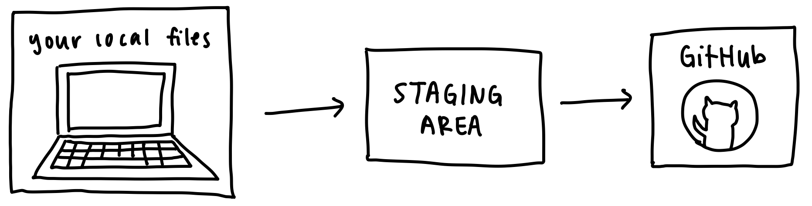
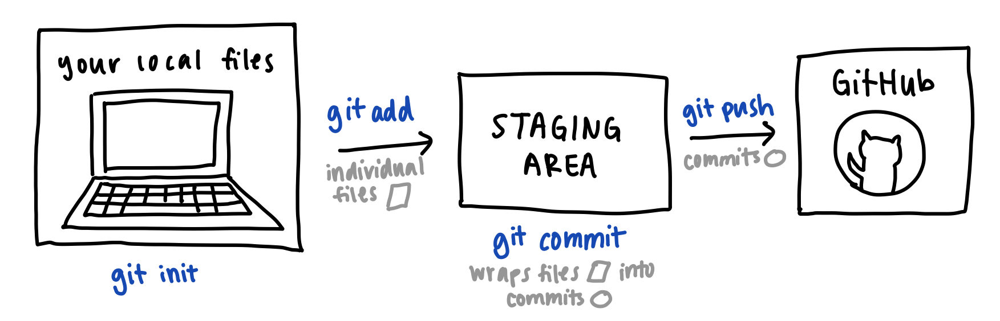

# Git Deliverable
Penn Spark Spring 2022

Written by [Grace J.](https://gracejiang.me/)

*Note: This tutorial is written for those with MacOS. If you use Linux or Windows, your terminal commands may be different.*


## Overview

Your task in this deliverable is to write a simple `README.md` file that displays information about you on your GitHub page. 


## Repository Setup

To get started, create a new [GitHub](https://github.com/) account or log into an existing account. Click the "+" button in the top right of the page, and select "New repository". Name the repository the same name as your GitHub username, and make sure Public is selected.




## Clone Git Repisitory to Local Drive

Clone your repository to your local workspace by running the following commands on terminal:

```
cd Desktop
git clone https://github.com/YOURUSERNAME/YOURUSERNAME
```

Make sure to replace `YOURUSERNAME` with your actual GitHub username (eg: I would use `gracejiang`). Next, navigate into your directory using `cd YOURUSERNAME`. You can run `pwd` to check that you are in the right directory.



*What my terminal looks like*

Great! Your repository is now cloned to your local workspace, and you're ready to start editing it. 


## Create README.md

Create a new README.md file by running the following command on terminal:

```
touch README.md
```


Next, open your `README.md` file in [VSCode](https://code.visualstudio.com/) (install it if you don't already have it) by running the following command:

```
code .
```


