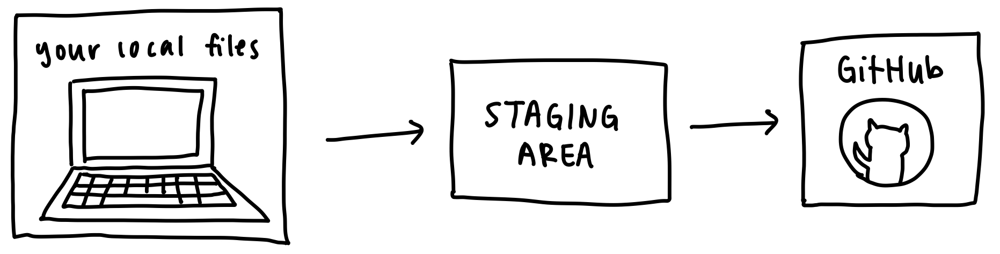
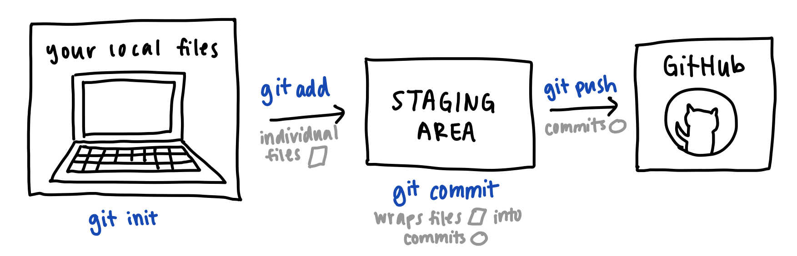

# Lesson 1: Git

## Git Overview

**What is Git?**

* Git is a software for tracking changes in files.
* Programmers use git to track changes made to code. 
* Git synchronizes code between different people. 

**What is GitHub?**
* GitHub is a user interface, or UI, wrapper around Git, much like Spotify is a UI wrapper around music. In these cases, a core technology (Git; music) is wrapped in a graphical user interface  (GitHub; Spotify).
* Sites like GitHub host Git repositories, or file systems that are tracked by Git.

**Why do we need Git?**
* Using Git allows you to save your code online. This means if you ever lose your local files (eg: laptop gets stolen), you still have a copy of your code through Git. 
* Git also allows collaborators to concurrently work on the same project, sort of like how Google Docs allows users to edit the same text document online.
* Finally, Git allows you to save "states" of your code, which allows you to revert to a previous state at any point in time.

## Git Workflow

## Git Basics

**Git Setup**
* `git init`: Initializes git within a local directory.
* `git remote add origin REPO_PATH`: Sets origin of git to repository at `REPO_PATH` (eg: repo path could be https://github.com/PennSpark/blue.git)
* `git status`: Check the status of files tracked by Git

**Git Workflow**
* `git add FILENAME`: Adds the file `FILENAME` to the staging area.
* `git commit -m "message here"`: Prepares everything in the staging area into a single "commit", which you can think of as a wrapper that contains all the changes made to your local files as well as storing metadata such as commit message.
* `git push`: Pushes all the commits in the staging area to GitHub! 

## Spark Resources

* [Git Slides](01-git-slides.pdf)
* [Git Workshop Activity](https://github.com/PennSpark/blue-git-workshop/blob/main/workshop.md#starting-your-journey) *(written by Akshay S.)*
* [Git Setup Guide](01-git-setup-guide.pdf) *(written by Akshay S.)*
* [Lesson Recording](https://drive.google.com/file/d/1sKdFgTGTLTJtbhlcxsSim7y9COz8NIWt/view?usp=sharing) *(Spark members only)*
* [Git Deliverable](/blue/dev/01-deliverable-git)

*Written by [Grace J.](https://gracejiang.me/)*
