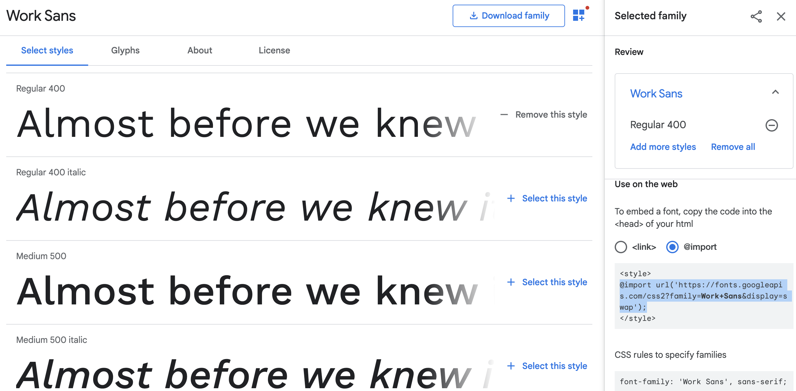

# 2.2 CSS

### What is HTML/CSS?

- **HTML**: describes the structure and content (skeleton) of a web page
- **CSS**: describes the formatting and style (skin) of a web page

 

### Our First CSS Code

- 
- CSS code comes in the format of an **selector** (such as `p`) followed by curly brackets `{ }`, with all the **styling code** (declarations) in between the brackets
- **Styling code** is the code that actually determines how your content will look
- The **styling code** inside the brackets is only applied to the HTML elements that match the tag type
- **NOTE**: Your **styling code** should separate each individual **declaration** with a semicolon `;`

```
h1, h2, h3, h4, h5, h6 {
    font-family: sans-serif;
    text-align: center;
}
```

- `h1, h2, h3, h4, h5, h6`: the **selector**, aka what kinds of elements you are modifying (in this case, header elements)
- `{` and `}`: encapsulates the actual **styling code** in between them
- `font-family`: what kind of font your website is using
  - `font-family` is the property
  - `sans-serif` is the value
  - **NOTE**: This is a declaration, so remember to end this line with a `;`
- `text-align`: How to justify the text on your page
  - `text-align` is the property
  - `center` is the value
  - **NOTE**: This is a declaration, so remember to end this line with a `;`

 

> #### TO-DO
>
> - Create a new file in your code editor
> - Copy and paste the code above into your file
> - Save the file into your folder as **style.css**

 

- But wait! Why are the changes not showing up?
- We need to first link the HTML and CSS files together so that **your website knows where to look** for styling

 

### Linking your CSS page to your HTML page

- Re-open your **index.html** page
- Inside your `<head>` tags, directly under the `<title>` tags, copy and paste the following code:
  - `<link rel="stylesheet" type="text/css" href="style.css">`
- Your code should look something like this:

```
<html>
  <head>
    <title>Your Title Here</title>
    <link rel="stylesheet" type="text/css" href="style.css">
  </head>
  <body>
    <h2>All your content is here~!</h2>
  </body>
</html>
```

- Your CSS code is now linked to your HTML code
- Refresh the page! Your changes should now be visible.

 

> #### TO-DO
>
> - Link your **style.css** page to your **index.html** page

 

- Notice that only your **header** elements have been modified
- Other elements (eg: `p`) are not styled because your CSS code has only defined the style (or **selected**) the **header** elements

 

### Selectors

- We can select a variety of elements
- **HTML Elements**
  - Select them by directly using the name of the HTML element

```
p {
    color: blue;
}
```

- **Classes**
  - Select them by putting a period `.` in front of the class name, for reusable html elements

```
.dogs {
    text-align: center;
}
```

- **IDs**
  - Select them by putting a period `#` in front of the element name, for unique html elements

```
#goldenDog {
    background-color: yellow;
}
```

- **General Selector**
  - **WARNING!!** Not recommended because it can cause weird formatting errors
  - The `*` selector applies to **every element** on your site
  - Most of the time, you want to use `body` instead of `*` since `*` applies to every single element

```
* {
    color: black;
}
```

 

### Styling your Page – Colors!

##### Properties

- `color`: defines text color
- `background-color`: defines background color of that element (more on this next section)

##### Values

- Colors can be specified using **direct names**, **RGB**, or **HEX**
- (1) **Direct Names**
  - eg: `black`, `azure`, `maroon`, etc.
  - See [full list or colors here](https://www.w3schools.com/colors/colors_names.asp)
- (2) **HEX**
  - eg: `#66bbcc`
  - Use [this color selector](https://www.google.com/search?q=color+picker&rlz=1C5CHFA_enUS807US807&oq=color+picker&aqs=chrome..69i57j0j69i59j0l3.980j0j1&sourceid=chrome&ie=UTF-8) to choose your own color (the bottom will tell you the HEX value)
- (3) **RBG Colors**
  - eg: `rgb(100, 100, 100)`
  - 1st parameter is value of **red** from 0-255
  - 2nd parameter is value of **green** from 0-255
  - 3rd parameter is value **blue** from 0-255
  - 4th **optional** parameter is transparency from 0-1 (automatically set to **1** if you don’t define it)
  - Use [this color selector](https://www.google.com/search?q=color+picker&rlz=1C5CHFA_enUS807US807&oq=color+picker&aqs=chrome..69i57j0j69i59j0l3.980j0j1&sourceid=chrome&ie=UTF-8) to choose your own color (the bottom will tell you the RGB values)

##### Putting it Together

- Put together the **property** and **value** to modify the colors on your page
- eg:

```
body {
    background-color: #edcee6;
}
```

> #### TO-DO
>
> - Modify the colors on your page as you see appropriate!

 


### Styling your Page – Backgrounds!

##### (1) Background Color

- **Property** `background-color`: defines background color of that element
- **Value**: Same as above, defined using either **direct name**, **HEX**, or **RGB**

##### (2) Background Image

- **Property** `background-image`: defines background of an element (such as a div) to be an image
- **Value**: What image you want it to be
  - Link using `url(""imagelinkhere")`
  - Eg: `url("pikachu.jpg")`

##### (3) Background Repeat

- **Property**: defines how the background is repeated
- **Values**:
  - No repeat: `no-repeat`
  - Regular repeat: `repeat` (auto-set to this value)
  - Repeat only horizontally: `repeat-x`
  - Repeat only vertically: `repeat-y`

##### (4) Background Position

- **Property**: defines where the image is positioned
- **Values**:
  - Horizontal, Vertical pairing
  - Horizontal Values:
    - `left`, `right`, `center`
  - Vertical Values:
    - `top`, `center`, `bottom`
  - **Examples:**
    - `left bottom`
    - `top right`
    - `center center` (auto-set to this value)

##### (5) Background Attachment

- **Property**: defines how image moves when scrolling
- **Values**:
  - `scroll`: background image scrolls with page (auto-set to this value)
  - `fixed`: background image does not scroll with page
  - `local`: background image will scroll with the element’s contents

```
body {
    background-image: url("pikachu.jpg");
    background-position: center center;
    background-attachment: fixed;
}
```

 

### Styling your Page – Borders, Margins, and Padding!

- **Border**: outline of element

- **Margin**: Space outside element

- **Padding**: Space inside element

  


#### Borders

##### (1) Border Style

- **Property**: `border-style`
- **Values**:
  - `dotted`
  - `dashed`
  - `solid`
  - `groove`
  - `ridge`
  - `inset`
  - `outset`
  - `none`

##### (2) Border Width

- **Property**: `border-width`
- **Values**:
  - A number followed by `px`
  - Eg: `2px`

##### (3) Border Color

- **Property**: `border-color`
- **Values**:
  - Same as previous colors! Use **direct names**, **HEX**, or **RGB**

```
div {

    border-style: dashed;

    border-width: 2px;

    border-color: green;

}
```


#### Margins

- Outside space around elements

##### (1) Defining Margin Size

- **Property**:
  - `margin` for all sides
  - `margin-top` for top margin
  - `margin-right` for right margin
  - `margin-bottom` for bottom margin
  - `margin-left` for left margin
- **Values**
  - Number followed by `px`
  - Eg: `25px`

```
div {
    margin: 10px;
}
```

#### Padding

- Inside space in element

##### (1) Defining Padding Size

- **Property**:
  - `padding` for all sides
  - `padding-top` for top padding
  - `padding-right` for right padding
  - `padding-bottom` for bottom padding
  - `padding-left` for left padding
- **Values**
  - Number followed by `px`
  - Eg: `25px`

```
div {
    padding: 10px 15px 20px 25px;
}
```

- Note: `10px` correlates to top padding, `15px` correlates to right padding, `20px` correlates to bottom padding, `25px` correlates to bottom padding

 

### Styling your Page – Fonts!

##### (1) Font Size

- **Property**: `font-size`
- **Value**:
  - Number followed by `px`, eg: `12px`
  - Number followed by `em`, eg: `1.2em`

##### (2) Font Type

- **Property**: `font-family` (what type of font is used)
- **Values**:
  - `serif`
  - `sans-serif`
  - `monospace`
- OR you can import your own custom fonts!
  1. Go to [Google Fonts](https://fonts.google.com/) and pick the font you like
  2. Select a font and copy and paste the **Embed Font** import statement into your **style.css file**
  3. You can now use the name of that font as the font type!




*Including `@import url('https://fonts.googleapis.com/css2?family=**Work+Sans**&display=swap');` in your **style.css** sheet allows you to use the "Work Sans" font!*


> ### TO-DO
>
> - Add a custom font to your page!

 

### Styling your Page – Images!

##### (1) Manual Sizing

- **Property**
  - `height`: height of image
  - `width`: width of image
- **Values**
  - Percentage: `50%`
  - Pixels: `300px`

##### (2) Fitting your Image to an Element

- **Property**: `object-fit`
- **Values**:
  - `fill`: fills entire element box, may be squished or stretched
  - `cover`: content ratio is maintained, but will fill entire element (aka it’ll be cropped)
  - `contain`: content ratio is maintained, will fit into entire element (may have whitespace around)

 

### Next Steps

- CSS has so many options that it’s impossible to cover all of them in one lesson
- I highly recommend using [**w3schools**](https://www.w3schools.com/css/default.asp) as a further resource!
