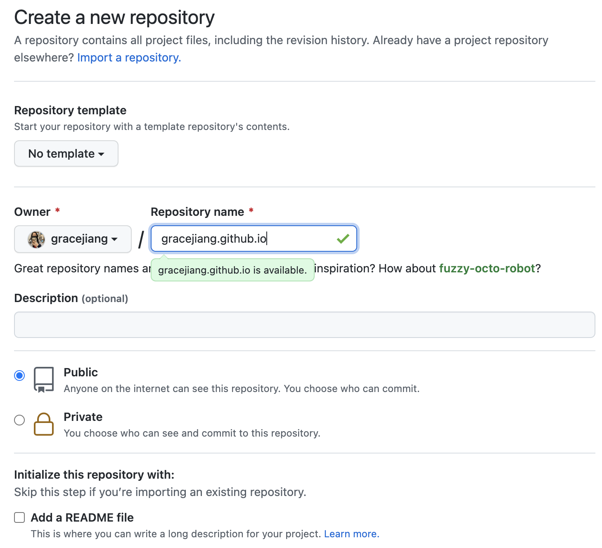
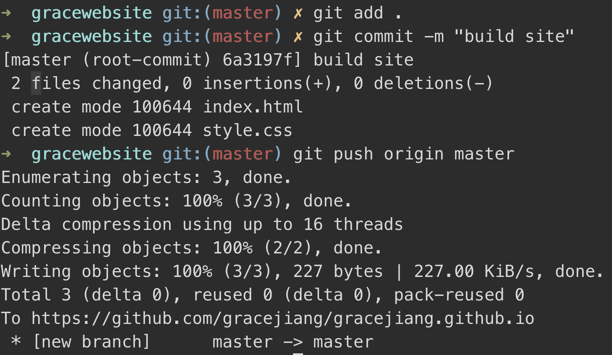

# 2.3 Deployment

Right now, the files you've been working on are stored locally onto your computer. In order to upload it to the internet so others can also see, we have to **deploy our website** online.

[toc]

### Creating Website Repository

- Click the plus sign in the upper right and click **create new repository**

- Name your new repository `username.github.io`, except replacing username with your own username (eg: mine would be `gracejiang.github.io`)

  

 

### Publish Your Changes

- Open **terminal** (Mac) or **command line** (Windows)
- Navigate to your folder using `cd` commands (use `pwd` to check you are in the right directory)
- Initialize git into your local directory using `git init`
- Point the origin of your directory to the proper git repository using `git remote add origin https://github.com/username/username.github.io.git`, replacing **username** with your own username
  - Eg: mine would be `git remote add origin https://github.com/gracejiang/gracejiang.github.io.git`

* Copy and paste each line into your terminal / command line

  - `git add .`: adds all files to staging area

  - `git commit -m "build site"`: prepares all files in staging area to be pushed

  - `git push origin master`: pushes all files to your github repo

 

 

### Checking Online

* Your website is now live at **[https://username.github.io](https://username.github.io/)** (replacing username with your own username)

  - Eg: mine is [https://gracejiang.github.io](https://gracejiang.github.io/)

  - Changes to live will usually take a while, so check back to your website in 5-10 minutes

### Congrats!

- Congratulations – you officially have your own personal website up and running on the internet!

### [Submit your deliverable here](https://forms.gle/KACnqQWUGqRALMEr7)