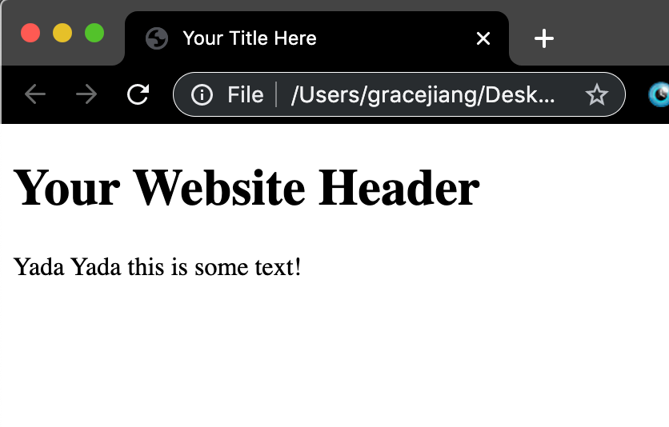

# 2.1 HTML

### What is HTML/CSS?

- **HTML**: describes the structure and content of a web page
- **CSS**: describes the formatting and style of a web page


[toc]

### Our First HTML Code

- HTML code generally comes in **pairs**: `<tag> content </tag>`
- Content goes **in between** the start and end tag
- End tag must match start tag, except with a **forward slash** in front of the tag name

```html
<!DOCTYPE html>
<html>
    <head>
        <title>Your Title Here</title>
    </head>
    <body>
        <h1>Your Website Header</h1>
        <p>Yada Yada this is some text!</p>
    </body>
</html>
```

- `<!DOCTYPE html>`: defines the document to be HTML
- `<html>` : put all your html code in between these tags!
- `<head>`: contains information about the web page – doesn’t actually show up on the webpage
- `<title>`: title of your web page
- `<body>`: actual content of your website: everything you want displayed should be inside the body tag
- `<h1>`: a header element (large text, usually used for titles of sections)
- `<p>`: a paragraph element (regular text, usually used for descriptions)


> #### TO-DO
>
> - Create a new folder on your Desktop and name it “**YourNameWebsite**” (eg: mine would be **GraceWebsite**)
> - Copy and paste the code above into your code editor
> - Save the file into your folder as **index.html**
> - Double click on your file **index.html** or open it in a web browser – your website should look something like this:
>
> 


### Basic HTML Elements

- So far, we’ve used `<h1>` and `<p>`
- There are a lot of other elements we can use! See **[full list here](https://www.w3schools.com/html/)**.
- **Headers**
  - Useful for titles of pages
  - `<h2></h2>`: size 2 header
  - `<h3></h3>`: size 3 header
  - `<h4></h4>`: size 4 header
  - `<h5></h5>`: size 5 header
  - `<h6></h6>`: size 6 header
- **Links**
  - Links to other websites
  - `<a href="https://google.com/">This is a link!</a>`
  - Website url goes after `href`
- **Images**
  - Pictures for your website
  - Does **not** need a closing tag
  - ``
- **Lists**
  - Unordered lists (bullet points)
    - `<ul>` `<li>Coffee</li>` `<li>Tea</li>` `<li>Milk</li>` `</ul>`
  - Ordered lists (1, 2, 3, …)
    - `<ol>` `<li>Coffee</li>` `<li>Tea</li>` `<li>Milk</li>` `</ol>`

 

> #### TO-DO
>
> - Add at least 3 different types of elements onto your website!

 

### Formatting Text (Optional)

- `<b>` or `<strong>`: bold text
- `<i>` or `<em>`: italic text
- `<small>`: small text

 

### Sectioning Your Page

- Grouping together similar elements

- `<div></div>`: used as container for other HTML elements, usually as big containers

  - Defines a “block” section

  - Eg:

  - ```html
    <div>
       <h2>Pikachu</h2>
       <p>Pikachu is Ash's trusty companion!</p>
       
    </div>
    ```

- `<span></span>`: used as container for some text, or for smaller containers

  - Defines a “inline” section

 

> #### TO-DO:
>
> - Split up your page into at least 3 different sections, using div and span.

 


### Styling Text

- Can change individual HTML element or section attributes with **style** attribute through **inline-styling**
- If you want to change style of **entire page**, use CSS instead (learned in next section)
- There are a lot of attributes you can change!
- **Text Color**
  - `<p style = "color: black;">`
  - **Standard Colors**:
    - `black`, `red`, `blue`, `green`, `purple`, `pink`, etc.
    - Find a [full list of colors here](https://www.w3schools.com/colors/colors_names.asp)
  - **RGB Colors and Hex Codes**
    - `rgb(255, 100, 50)`
    - `#f8f8f8`
    - Can get a color’s rgb value using [this color selector tool](https://www.google.com/search?rlz=1C5CHFA_enUS807US807&sxsrf=ACYBGNRDMNE3IB-is3-MhCKBDsdWwWaw-Q%3A1574114272573&ei=4BPTXe7HItDz5gLDla34CA&q=color+picker+tool&oq=color+&gs_l=psy-ab.1.2.35i39l2j0i67l8.1841.2305..5402...0.3..0.163.514.5j1......0....1..gws-wiz.......0i71.m98R4IDHoHA)
- **Text Size**
  - `<p style="font-size: 200%;">`
- **Text Alignment**
  - `<p style = "text-align: center;">`
- **Background Color**
  - `<p style = "background-color: black;>`

 

 

### Identifying Elements on Your Page

- Group together similar elements, usually for styling and clarity purposes

- All HTML elements with the same class get the same style

- **Classes**

  - Multiple elements with similar properties
  - `<div class="dogs"> content here~ </div>`

- **IDs**

  - Unique iD for a singular HTML element
  - `<div id="goldenDog"> this is a golden dog! </div>`

  > #### TO-DO:
  >
  > - Separate the content on your page into *classes* and *ids* where appropriate

 


### Congrats! + Recap

- End of HTML tutorial!
- All the actual **content** of your page should be in HTML
- Now we’ll learn how to style and format the entire page using CSS
